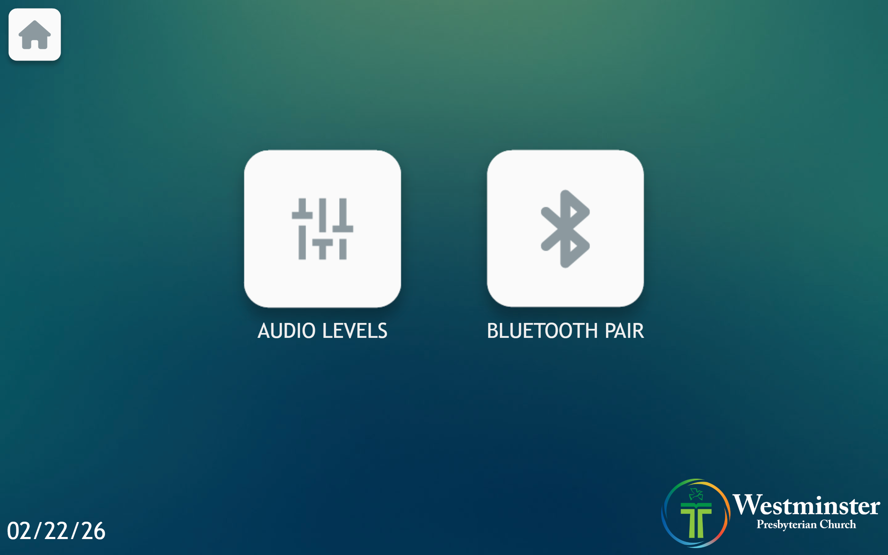
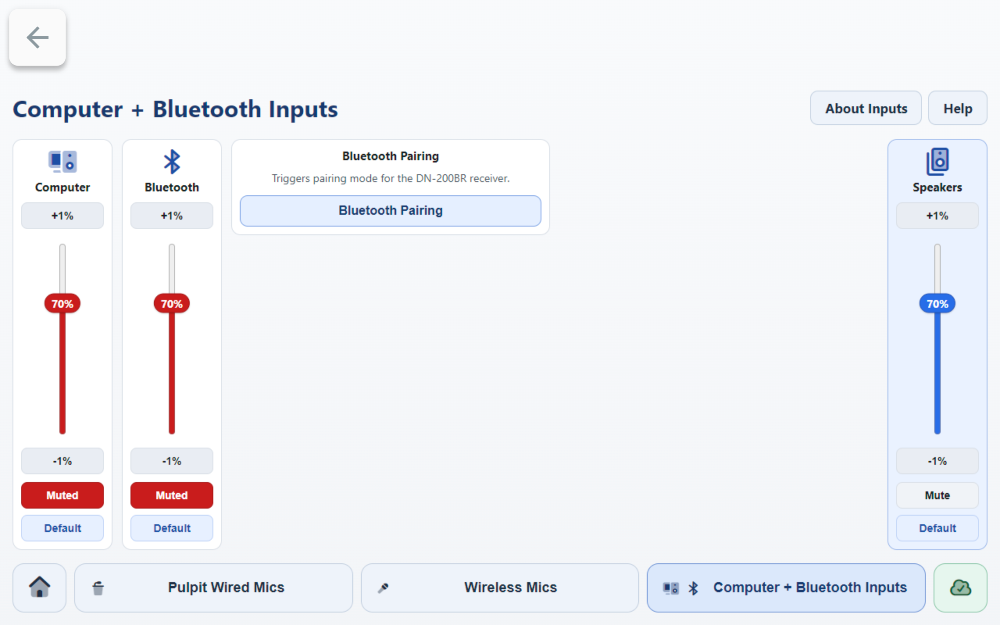

# Bluetooth Pairing

This guide explains how to pair a Bluetooth playback device in Mackey Hall. Use Bluetooth when you want to play audio from a phone, tablet, or laptop without plugging in an audio cable.

If the sound system is not on, see [Turning the Sound System On](turning_sound_system_on.md).

## What to Expect
Bluetooth has two parts:
1. Pair your device with the room receiver named `DN-200BR`.
2. Unmute and raise the `Bluetooth` channel in the iPad audio controls.

Pairing alone does not guarantee sound. The Bluetooth channel must also be active in the room controls.

## Start Pairing Mode (Two Ways)
### Method 1: From the Audio Page
1. On the wall touchscreen Homepage, press `Audio`.
   
2. On the Audio page, press `Bluetooth Pair`.
   
3. Wait a few seconds for pairing mode to activate.
4. If room speakers are unmuted, you should hear a beep when pairing mode starts.

### Method 2: From Audio Levels -> Computer + Bluetooth Inputs
1. On **Select a Preset**, choose `Computer + Bluetooth Inputs`.
2. On that page, press `Bluetooth Pairing`.
3. Wait a few seconds for pairing mode to activate.
4. If room speakers are unmuted, you should hear a beep when pairing mode starts.

## Connect Your Device
1. On your phone, tablet, or computer, open Bluetooth settings.
2. Select `DN-200BR` from available devices.
3. Confirm the device shows as connected.
4. Start playback on your device.

## Route Bluetooth Audio to Speakers
1. On the wall touchscreen Audio page, press `Audio Levels`.
2. On **Select a Preset**, choose `Computer + Bluetooth Inputs`.
3. In that preset, find the `Bluetooth` channel card.
4. If `Muted` is red, press it once to unmute.
5. Start playback and adjust `Bluetooth` level with `+1%`, `-1%`, or the slider.
6. Use the `Speakers` card on the right (`Master Output`) for overall room output level.

## Notes
- Pairing is for playback devices only.
- If pairing fails, press `Bluetooth Pair` again and retry from Bluetooth settings.
- Only one device should be connected for the event. Disconnect old devices if the wrong device is playing.

## If You Do Not Hear Bluetooth Audio
- Confirm your device is connected to `DN-200BR`.
- Confirm your device is playing audio and its volume is turned up.
- Confirm the `Bluetooth` channel is unmuted in `Computer + Bluetooth Inputs`.
- Confirm `Master Output` is high enough for the room.
- If your device will not connect, turn Bluetooth off and back on, then press `Bluetooth Pair` again.
