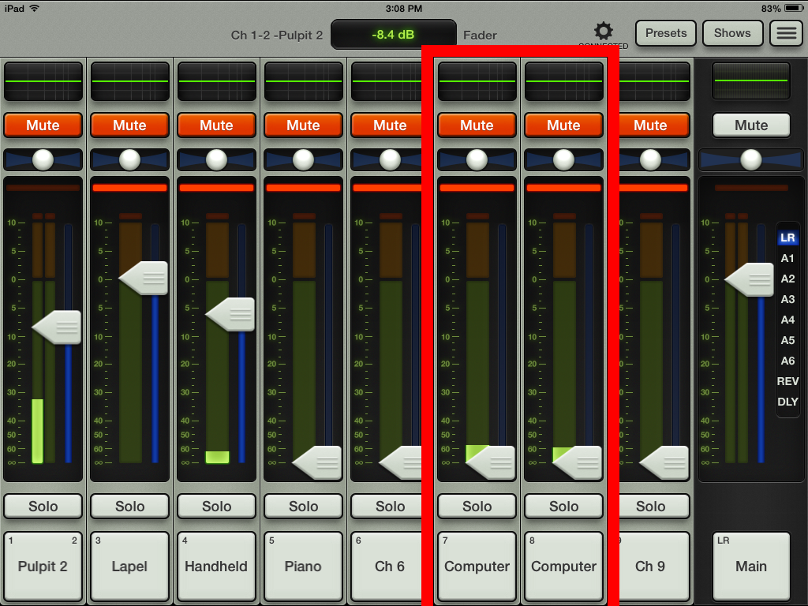
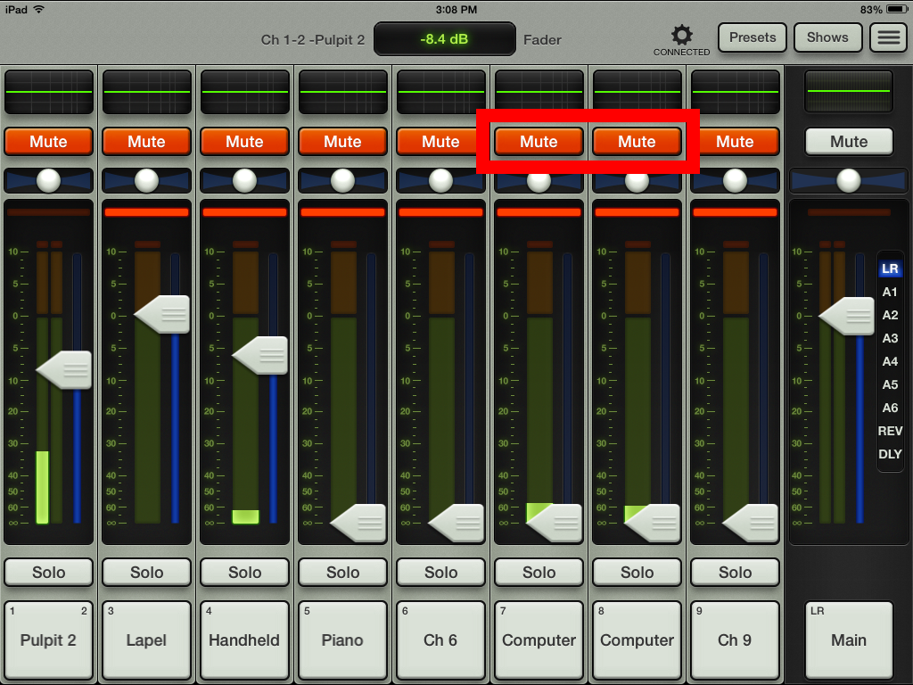

# Using Computer Audio

Follow the steps below to to use computer audio with the speakers in Mackey Hall.

---

## 1. Connect Computer to Projector / Sound System
  Connect your device to the projector / sound system. You do not have to use the projector. You can connect using a 3.5mm audio cable and the jacks on your computer and one of the two jacks in Mackey Hall, or by using HDMI. If you need help with the inputs, see the article entitled ["Input Methods"](../video/inputs.md).
 
## 2. Computer Volume Levels
  Turn up the volume on the computer to somewhere near 10 (or about 10% of total volume). Any higher of audio become too loud and becomes garbled when put into the system. From here, you will change computer volume levels using the iPad and Master Fader. See the page entitled ["Connecting iPad to Sound System"](ipad_sound_system.md) for help with getting the iPad connected to the sound system.

## 3. Master Fader
  In Master Fader, you will see one of two different slider options. Sometimes the computer sliders (7 & 8) are combined together into one slider, and sometimes they aren't combined. 

### A. Combined Sliders
  

### B. Separate Sliders
  

## 4. Changing Audio Levels
  Whether it's using the combined single slider or the two separate sliders, move the slider to the level that you want it at. It's best to have audio playing and start lower on the slider dial when adjusting.

## 5. Muting / Unmuting
  To mute/unmute, click the mute button at the top of the sliders. Orange is muted, white is unmuted.
   
   