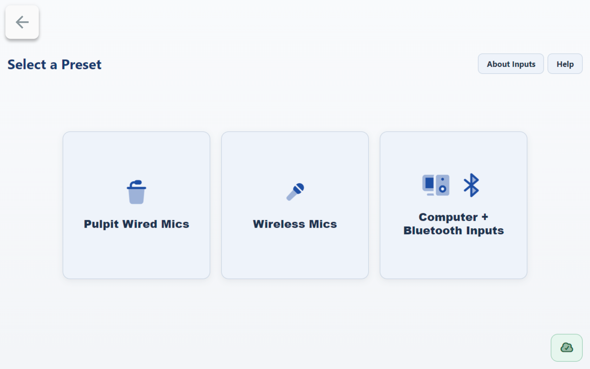
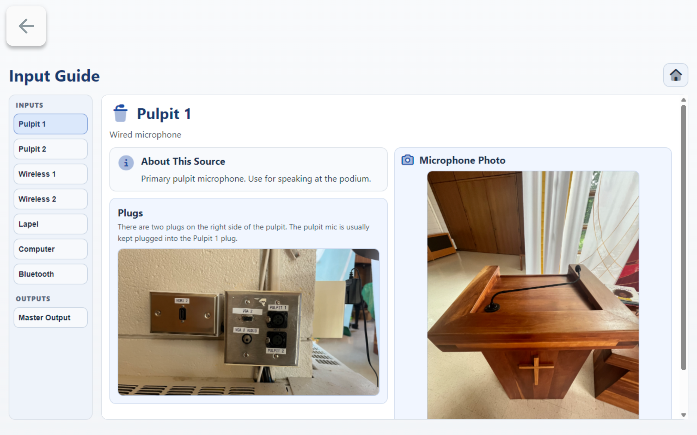
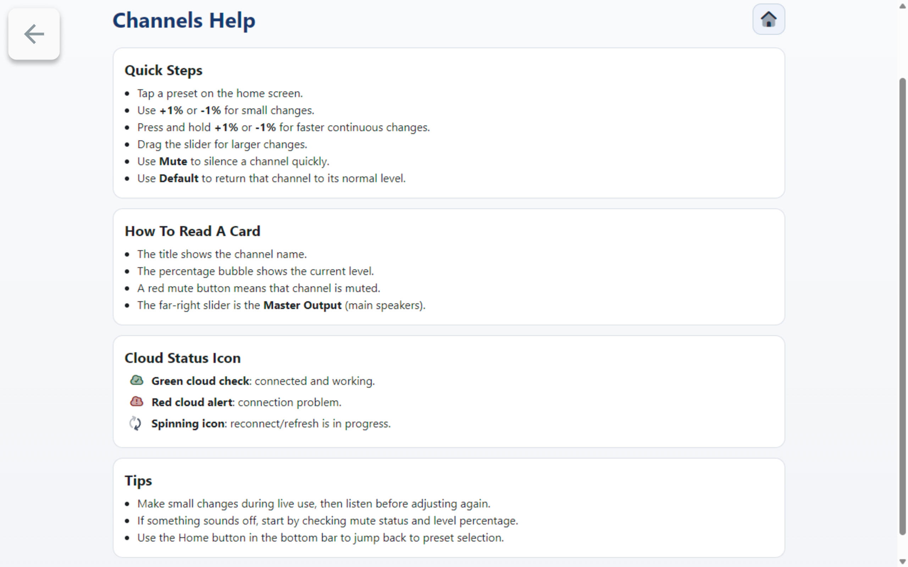

# Using Computer Audio

This guide explains how to play audio from a computer in Mackey Hall. Use this when you want sound from a laptop, the Church PC, or another connected computer to play through the room speakers.

If the sound system is not on, see [Turning the Sound System On](turning_sound_system_on.md).

## Before You Start
- Connect video first if you are showing slides or video.
- HDMI usually carries picture and sound together.
- VGA only carries picture, so it also needs a 3.5mm audio cable for sound.
- The computer volume and the room audio controls both affect what people hear.

## Connect Your Computer
1. Connect your computer using one of these methods:
   - `HDMI` (carries video and audio together)
   - `3.5mm audio` cable (audio only)
2. If you are also using video, choose the cable type that matches your selected video input.
3. For port locations, see [Input Methods](../video/inputs.md).

## Open Audio Levels
1. On the **Select a Preset** screen, press `Computer + Bluetooth Inputs`.
   

## Use the Computer Input Channel
1. In `Computer + Bluetooth Inputs`, find the `Computer` channel card.
2. If the channel shows `Muted` in red, press it once to unmute.
3. Start playback on your computer.
4. Adjust the `Computer` level using `+1%`, `-1%`, or the slider.
    

## Helpful On-Screen References
- Press `About Inputs` for source and connection reference details.
- Press `Help` for quick control tips (`+1%`, `-1%`, hold to ramp, Mute/Unmute, and Default level behavior).

## If You Do Not Hear Computer Audio
- Make sure the computer is actually playing sound.
- Turn up the computer volume.
- If using HDMI, confirm the computer selected the HDMI/display audio output.
- If using VGA, confirm the 3.5mm audio cable is connected.
- Confirm the `Computer` channel is unmuted in the `Computer + Bluetooth Inputs` preset.
- Confirm `Master Output` is high enough for the room.
