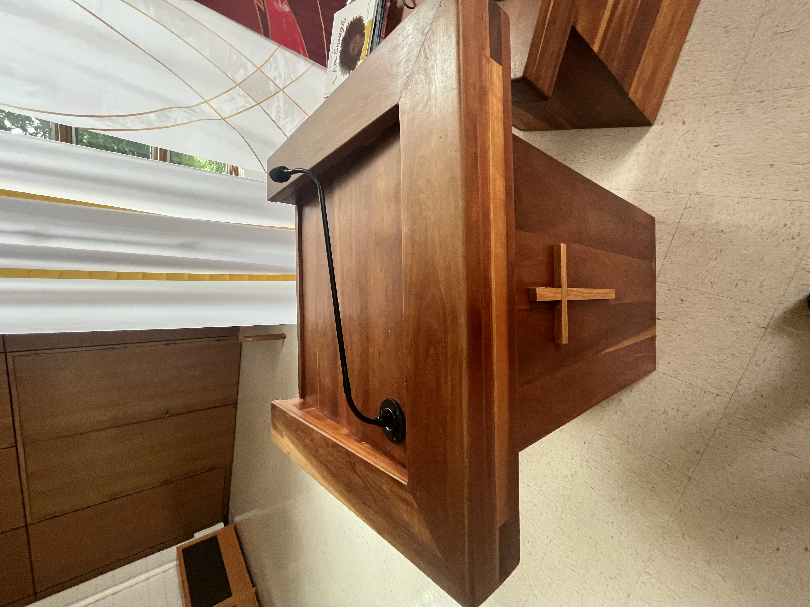
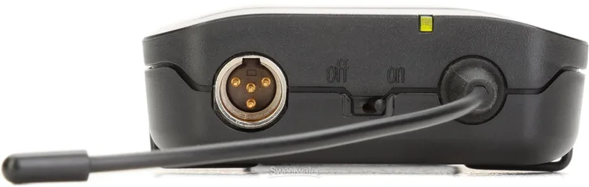
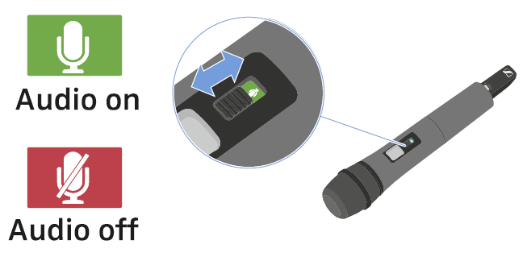

# Connecting and Using Microphones

This guide explains how to set up and use microphones in Mackey Hall with the wall touchscreen audio controls.

## Before You Start
1. Make sure the sound system is on. If needed, see [Turning the Sound System On](turning_sound_system_on.md).
2. Open the wall touchscreen audio controls and select the correct preset. If needed, see [Using Wall Audio Controls](wall_audio_controls.md).
3. Use `Pulpit Wired Mics` for pulpit channels `Pulpit 1` and `Pulpit 2`.
4. Use `Wireless Mics` for `Wireless 1`, `Wireless 2`, and `Lapel`.

## Pulpit Microphone
1. Locate the pulpit microphone and cable, if not already plugged in.
2. Plug the microphone into `Pulpit 1` or `Pulpit 2`.
3. On the wall controls, open `Pulpit Wired Mics`.
4. If the selected pulpit channel shows `Muted` in red, press it once to unmute.
5. Set level with `+1%`, `-1%`, or the slider.

## Lapel Microphone (Wireless)
1. Locate the lapel bodypack and lapel mic (kept in the pulpit when not in use).
2. Power: move the top power switch to `on`.
3. Clip the lapel mic and begin speaking.
4. On the wall controls, open `Wireless Mics` and use channel `Lapel`.
5. If channel `Lapel` shows `Muted` in red, press it once to unmute.
6. Set level with `+1%`, `-1%`, or the slider.

#### Lapel Reference Images
**Lapel Microphone Bodypack**

**Lapel Power On/Off Switch**

## Handheld Wireless Microphones
### Wireless 1 (Handheld 1)
1. Locate `Handheld 1` (kept in the pulpit when not in use).
2. Power: short-press `ON/OFF` to turn on; press and hold `ON/OFF` to turn off.
3. Mute: use the handheld mute switch to mute or unmute the mic.
4. On the wall controls, open `Wireless Mics` and use channel `Wireless 1`.
5. If channel `Wireless 1` shows `Muted` in red, press it once to unmute.
6. Set level with `+1%`, `-1%`, or the slider.

#### Wireless 1 Reference Images
**Wireless 1 Microphone Body**

**Wireless 1 Power Indicator**

**Wireless 1 ON/OFF Button**

**Wireless 1 Mute/Unmute Switch**

### Wireless 2 (Handheld 2)
1. Locate `Handheld 2` (kept in the pulpit when not in use).
2. Power: slide the switch to turn the microphone on or off.
3. On the wall controls, open `Wireless Mics` and use channel `Wireless 2`.
4. If channel `Wireless 2` shows `Muted` in red, press it once to unmute.
5. Set level with `+1%`, `-1%`, or the slider.

#### Wireless 2 Reference Images
**Wireless 2 Microphone Body**

## Mute and Level Notes
- A red `Muted` button on the wall controls means that channel is muted.
- Press `Muted` once to unmute.
- Use `Default` to return a channel to its normal level.
- You can press and hold `+1%` or `-1%` for faster continuous changes.
- Start with lower levels, speak into the microphone, then raise gradually.
- If a wireless mic has no audio, check battery level and power switch position.
