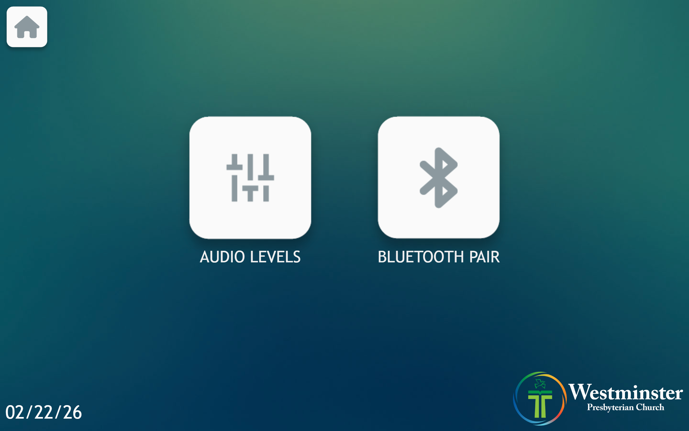
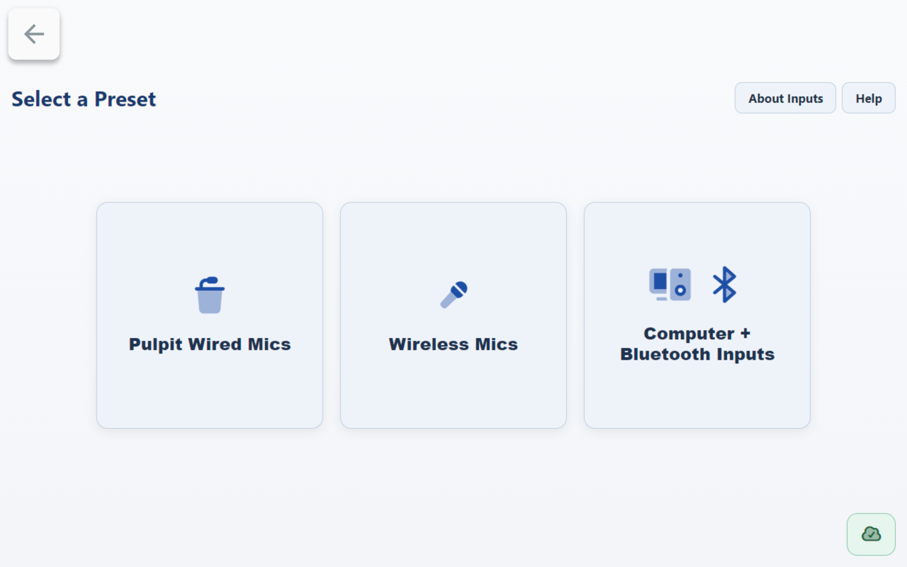
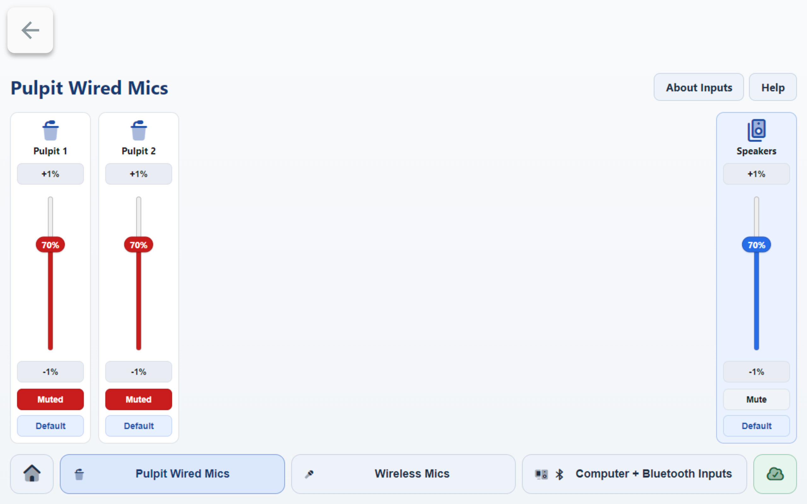
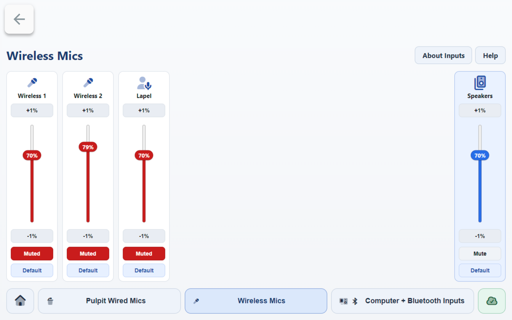
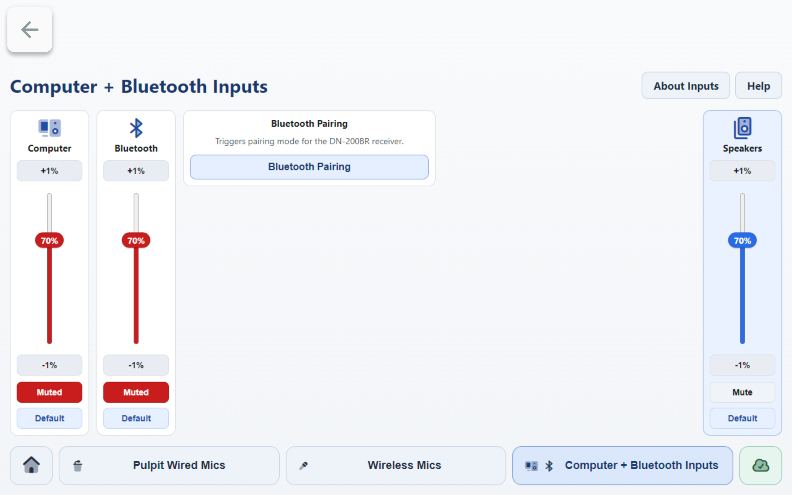
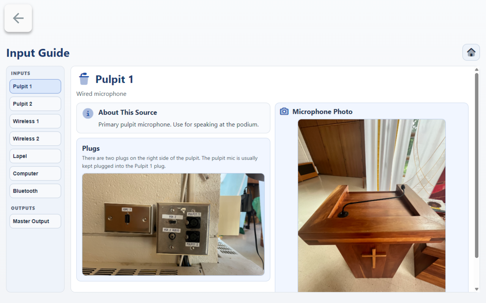
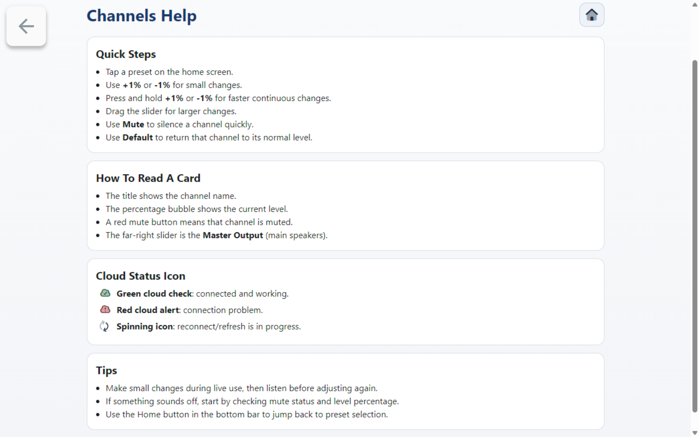

# Using Wall Audio Controls

This guide explains how to use the wall touchscreen audio controls in Mackey Hall.

If the sound system is not on, see [Turning the Sound System On](turning_sound_system_on.md).

## Open Audio Levels
1. On the wall touchscreen Homepage, press `Audio`.
   
2. On the Audio page, press `Audio Levels`.
   

## Select a Preset
1. On the **Select a Preset** screen, choose the preset you need:
   - `Pulpit Wired Mics`
   - `Wireless Mics`
   - `Computer + Bluetooth Inputs`

## Adjust Channel Levels
1. Find the channel card you want to adjust.
2. If a channel shows `Muted` in red, that channel is muted and no audio will pass.
3. Press `Muted` once to unmute the channel.
4. Use `+1%`, `-1%`, or the slider to set the channel level.
5. Use the `Speakers` card on the right (`Master Output`) for overall room output level.

## Helpful On-Screen References
- Press `About Inputs` for source and connection reference details.
- Press `Help` for quick control tips (`+1%`, `-1%`, hold to ramp, Mute/Unmute, and Default level behavior).
- On `Help`, a red `Muted` button means that channel is muted.

