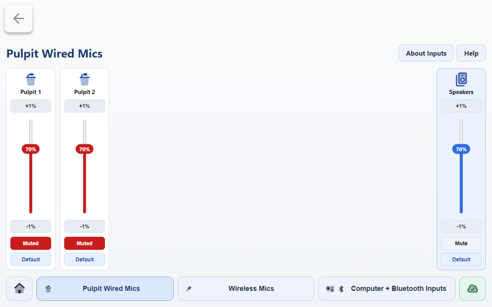
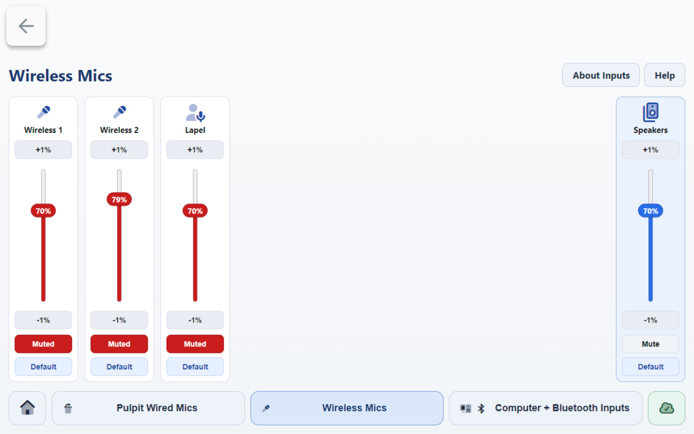

# Using Audio Controls

This guide explains how to use the iPad touchscreen audio controls in Mackey Hall.

If the sound system is not on, see [Turning the Sound System On](turning_sound_system_on.md).

## What the iPad Controls Do
The iPad chooses which audio sources are active and how loud they are in the room. A source can be connected correctly and still be silent if its channel is muted or turned down.

## Key Terms
- **Preset**: A saved group of controls for a common setup, such as wired pulpit microphones or wireless microphones.
- **Channel**: One audio source, such as `Lapel`, `Computer`, or `Bluetooth`.
- **Muted**: The channel is intentionally silent. Red `Muted` means no sound will pass for that source.
- **Master Output**: The overall speaker level for the room.

## Get Control iPad
Locate the control iPad, which is housed in a black freestanding case. It is typically positioned on top of the sound system rack.

## Select a Preset
1. On the **Select a Preset** screen, choose the preset you need:
   - `Pulpit Wired Mics`
   - `Wireless Mics`
   - `Computer + Bluetooth Inputs`

## Adjust Channel Levels
1. Find the channel card you want to adjust.
2. If a channel shows `Muted` in red, that channel is muted and no audio will pass.
3. Press `Muted` once to unmute the channel.
4. Use `+1%`, `-1%`, or the slider to set the channel level.
5. Use the `Speakers` card on the right (`Master Output`) for overall room output level.
6. Make changes gradually. A small increase on a microphone can be enough.

## Helpful On-Screen References
- Press `About Inputs` for source and connection reference details.
- Press `Help` for quick control tips (`+1%`, `-1%`, hold to ramp, Mute/Unmute, and Default level behavior).
- On `Help`, a red `Muted` button means that channel is muted.

## If You Do Not Hear Sound
- Confirm the sound system is on.
- Confirm you selected the preset that matches what you are using.
- Confirm the specific channel is unmuted.
- Confirm `Master Output` is not turned all the way down.
- For microphones, speak into the microphone while adjusting the level.
- For computer or Bluetooth audio, start playback on the device and confirm the device volume is up.
