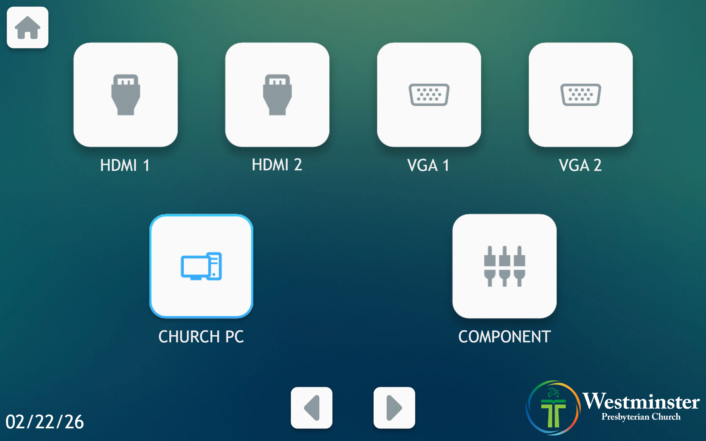
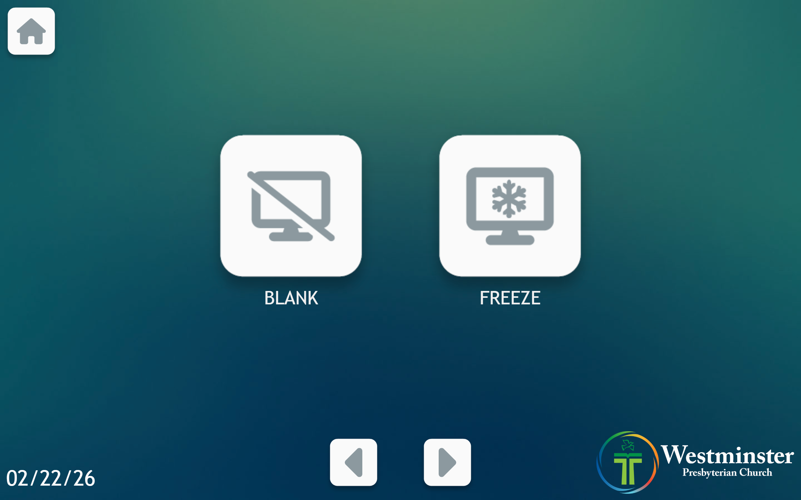
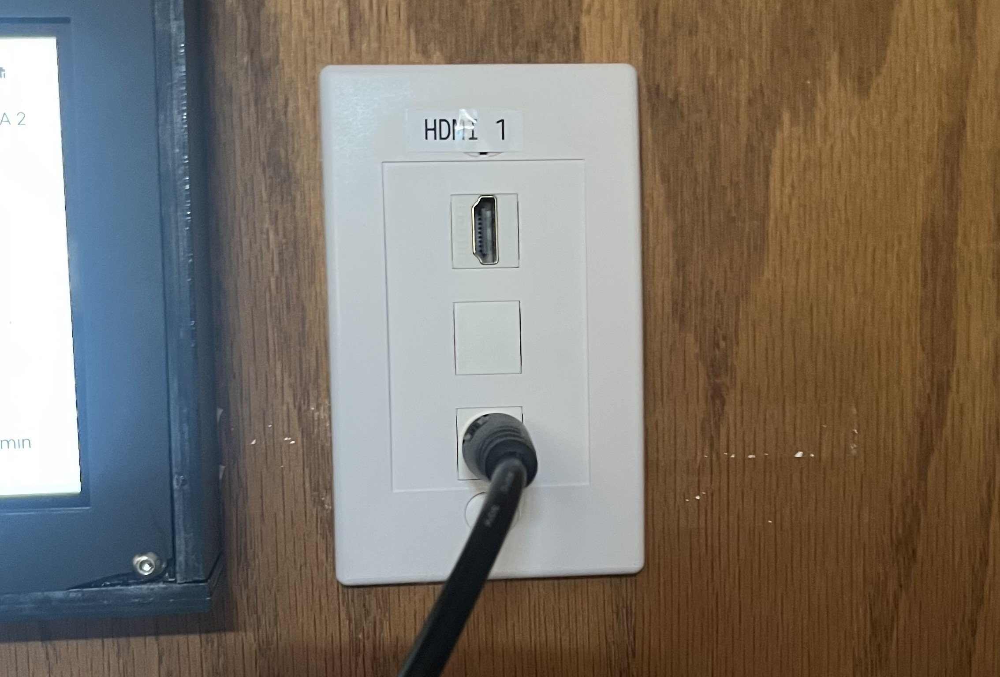
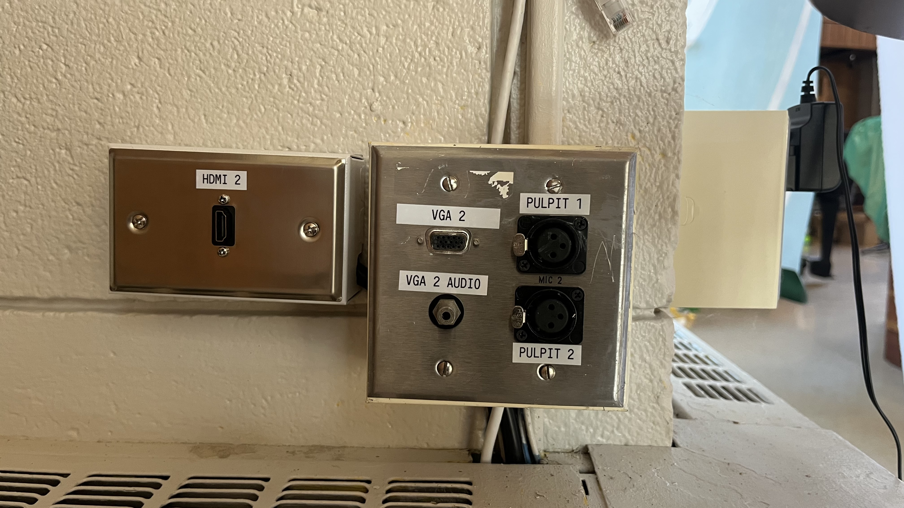

# Computer Input Methods

This guide explains how to connect devices in Mackey Hall and switch video sources from the wall touchscreen.

## Connecting Devices
1. Locate the input ports on the wall outside the Scout Closet, under the projector screen, and by the sound system/chair closet wall.
2. Connect your device to the matching labeled port.
3. On the touchscreen, select the input that matches the port label you used.

## Switching Inputs on the Touchscreen
1. Go to the wall touchscreen in Mackey Hall.
2. If you are not on the Homepage or the `Video` page, press the `Home` icon in the top-left corner.
3. If you are on the Homepage, press `Video` to open input controls. If you are already on the `Video` page, continue to the next step.
   
   **Press `Video` on the homepage to open input controls.**
4. On the first `Video` page, press the input button that matches your connected port.
5. The selected source will light up blue when it is active.
   
   **Select the input that matches your connected port label.**
6. Use the left/right arrows at the bottom to move between Video pages.
7. On the second `Video` page, use `Freeze` to pause the current image or `Blank` to black out the screens.
   
   **Use the bottom arrows to switch pages. `Freeze` and `Blank` are on the second Video page.**

## Input Methods
### HDMI Inputs
Mackey Hall has three HDMI inputs:
- `Church PC HDMI`: Located with the VGA and RCA ports under the input selector panel. Reserved for the Church PC.
- `HDMI 1`: Located near the control touchscreen for personal devices.
- `HDMI 2`: Located on the wall outside the Scout Closet, under the projector screen, for personal devices.

HDMI carries both video and audio over one cable.

#### Church PC HDMI Input

#### HDMI 1 Input

#### HDMI 2 Input

### VGA Inputs
There are two VGA input locations in Mackey Hall:
1. `Laptop 1 (VGA)`: Under the input selector panel with its matching 3.5mm audio port.
2. `Laptop 2 (VGA)`: On the wall outside the Scout Closet, under the projector screen, with its matching 3.5mm audio port.

VGA requires two cables for full A/V: VGA (video) plus 3.5mm (audio).

#### Laptop 1 Input

#### Laptop 2 Input

### RCA Input
There is one RCA input under the input selector panel.
- Yellow: video
- White/Red: left/right audio

