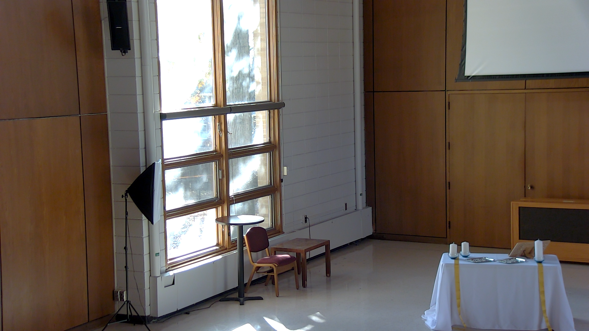
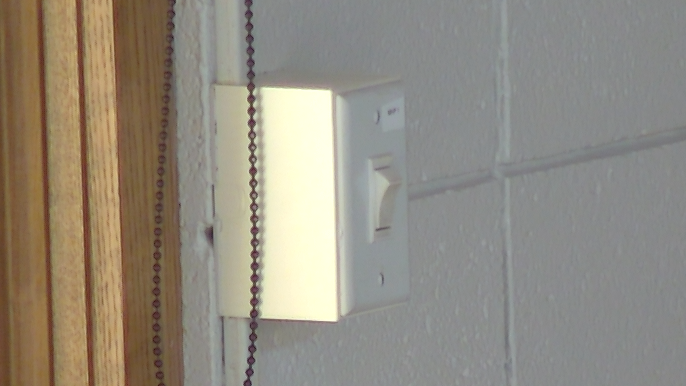

# Lowering Projector Screen

This guide explains how to lower the projector screen in Mackey Hall. Lower the screen before turning on the projector or showing slides.

If you need the reverse process, see [Retracting Projector Screen](./retracting_screen.md).

## At a Glance
- Use the wall switch by the south windows.
- Press the lower half of the switch to send the screen down.
- Return the switch to the center position after the screen stops.

## Locate the Screen Control
The projector screen control switch is on the south wall, to the right of the windows.

## Lower the Screen
1. Press the lower half of the screen control switch fully in.
2. The switch is a maintained toggle, so it will stay in the selected position.
3. Wait while the screen lowers.
4. The screen will stop automatically at its lowest position.
5. Toggle the switch back to the neutral (center) position after the screen is fully lowered.

## If It Does Not Work
- Make sure you pressed the switch fully into the down position.
- If the screen is already down, do not keep pressing the switch.
- If the screen does not move after a few seconds, return the switch to the center position and ask for help.

## Technical Note
The switch is a maintained toggle. That means it stays in the up or down position until someone returns it to center.
