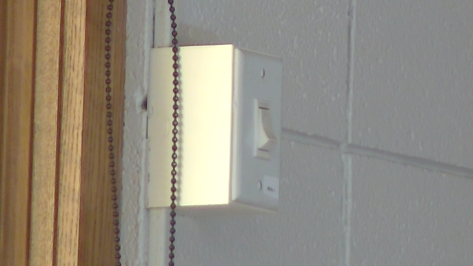

# Retracting Projector Screen

This guide explains how to retract the projector screen in Mackey Hall. Retract the screen after the projector is off and the event is finished.

If you need the reverse process, see [Lowering Projector Screen](./lowering_screen.md).

## At a Glance
- Use the wall switch by the south windows.
- Press the upper half of the switch to send the screen up.
- Return the switch to the center position after the screen stops.

## Locate the Screen Control
The projector screen control switch is on the south wall, to the right of the windows.

## Retract the Screen
1. Press the upper half of the screen control switch fully in.
2. The switch is a maintained toggle, so it will stay in the selected position.
3. Wait while the screen retracts.
4. The screen will stop automatically at its fully retracted position.
5. Toggle the switch back to the neutral (center) position after the screen is fully retracted.

## If It Does Not Work
- Make sure you pressed the switch fully into the up position.
- If the screen is already retracted, do not keep pressing the switch.
- If the screen does not move after a few seconds, return the switch to the center position and ask for help.

## Technical Note
The switch is a maintained toggle. That means it stays in the up or down position until someone returns it to center.
