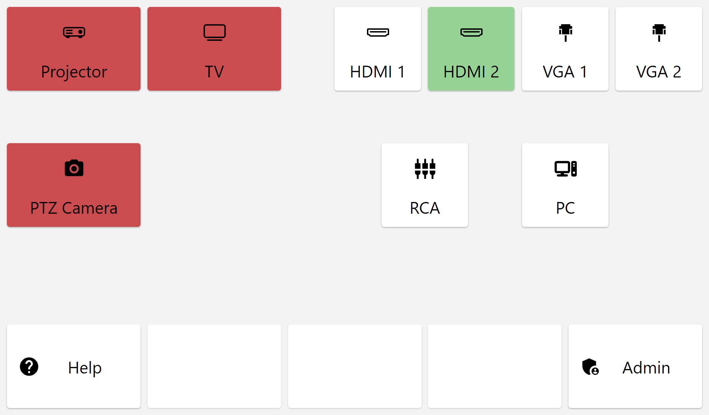

# Turning Projector / Rear TV Off

## Introduction 
This guide details how to turn off the projector or rear TV in Mackey Hall. Below, see detailed instructions. 

If you need information on turning on the projector or rear TV, please refer to [this article](./turning_projector_on.md "Turning Projector / Rear TV On").

---

## Note Regarding Wall Controls (Updated October 2024)
 There is a touch screen on the wall that replaces the old wall controls above the church PC. This is the best way to turn the projector or TV on. Below you will see two screens are called out. A second one located under the projector is planned. As of October 2024, the one above the church PC is the only screen installed.

## Power Off Projector
To power off the projector, follow these steps:

1. Go to one of the two touch screens located in Mackey.
   - Either above the church PC or under the projector.
2. Locate the "Projector" button in the top left.
3. The button will be red when the projector is off, and will turn green when the projector is fully powered on.
4. Press the "Projector" button to power off the projector (see image below). This action will initiate the power-off sequence.
5. You will hear a beep from the projector and the blue light on the underside of the projector will turn red, indicating that it is powered off.

  

## Power Off Rear TV
To power off the rear TV, follow these steps:

1. Go to one of the two touch screens located in Mackey.
   - Either above the church PC or under the projector.
2. Locate the "TV" button near the top left.
3. The button will be red when the TV is off, and will turn green when the TV is powered on.
4. Press the "TV" button to power off the rear TV (see image below). This action will initiate the power-off sequence.

  