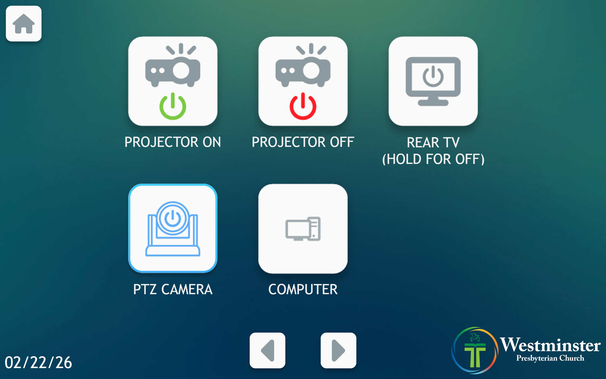

# Turning Projector / Rear TV On

This guide explains how to power on the projector and rear TV in Mackey Hall using the wall touchscreen.

If you need the reverse process, see [Turning Projector / Rear TV Off](./turning_projector_off.md).

## Power On Projector
1. Go to the wall touchscreen in Mackey Hall.
2. If you are not on the Homepage or the `Power` page, press the `Home` icon in the top-left corner.
3. If you are on the Homepage, press `Power` to open the power controls. If you are already on the `Power` page, continue to the next step.
   
   **Press the `Power` button on the homepage.**
4. On the Power page, press `Projector On` to power on the projector.
   
   **Press `Projector On` to power on the projector.**
5. Allow about 30 seconds for the projector to fully start.

## Power On Rear TV
1. Go to the wall touchscreen in Mackey Hall.
2. If you are not on the Homepage or the `Power` page, press the `Home` icon in the top-left corner.
3. If you are on the Homepage, press `Power` to open the power controls. If you are already on the `Power` page, continue to the next step.
   
   **Press the `Power` button on the homepage.**
4. On the Power page, press `Rear TV` to power on the rear TV.
   
   **Press `Rear TV` to power on the rear TV.**
5. Allow a few seconds for the rear TV to fully power on.
