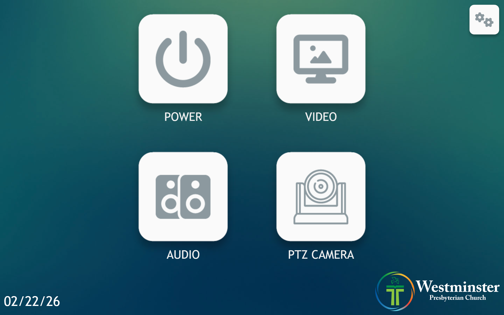
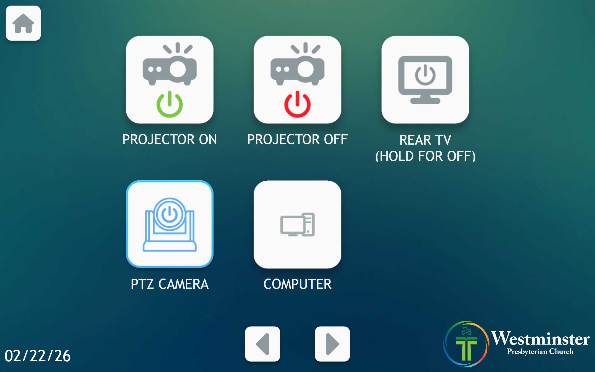

# Turning Projector / Rear TV On

This guide explains how to power on the projector and rear TV in Mackey Hall using the wall touchscreen. Use the projector for the front screen and the rear TV when presenters or leaders need to see the same image from the back of the room.

If you need the reverse process, see [Turning Projector / Rear TV Off](./turning_projector_off.md).

## Before You Start
- Lower the projector screen first if you plan to use the projector.
- Decide whether you need the projector, the rear TV, or both.
- Turning on the display only powers the display. You still need to choose the correct [video input](./inputs.md).

## Power On Projector
1. Go to the wall touchscreen in Mackey Hall.
2. If you are not on the Homepage or the `Power` page, press the `Home` icon in the top-left corner.
3. If you are on the Homepage, press `Power` to open the power controls. If you are already on the `Power` page, continue to the next step.
   
   **Press the `Power` button on the homepage.**
4. On the Power page, press `Projector On` to power on the projector.
   
   **Press `Projector On` to power on the projector.**
5. Allow about 30 seconds for the projector lamp and image to fully start.

## Power On Rear TV
1. Go to the wall touchscreen in Mackey Hall.
2. If you are not on the Homepage or the `Power` page, press the `Home` icon in the top-left corner.
3. If you are on the Homepage, press `Power` to open the power controls. If you are already on the `Power` page, continue to the next step.
   
   **Press the `Power` button on the homepage.**
4. On the Power page, press `Rear TV` to power on the rear TV.
   
   **Press `Rear TV` to power on the rear TV.**
5. Allow a few seconds for the rear TV to fully power on.

## If You Do Not See an Image
- Confirm the projector or rear TV has had enough time to turn on.
- Confirm your computer or device is connected to the correct wall port.
- Open the [Computer Input Methods](./inputs.md) guide and choose the input that matches the port label.
- If using a laptop, make sure it is sending video to an external display.
